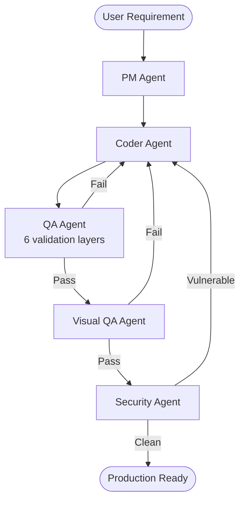

# Multi-Agent Dev Team

**A self-healing multi-agent pipeline that plans, codes, tests, verifies visually, and scans for security — autonomously.**

Most AI code generators stop at "it works on my machine." This project runs the code through **six validation layers** and **self-heals** on failure — catching the bugs that demos miss.

## Architecture

GitHub renders Mermaid diagrams natively. This is worth adding — interviewers love visual architecture.
## Tech Stack

- **Orchestration**: LangGraph (stateful multi-agent graphs)
- **LLM**: Ollama (qwen2.5-coder, llama3.2) — local, zero-cost
- **API**: FastAPI with Server-Sent Events
- **Persistence**: SQLite
- **Testing**: pytest
- **Visual**: Playwright + Pillow
- **Security**: Bandit
- **Dashboard**: Vanilla HTML/CSS/JS

## Quick Start
# Setup
pip install -r requirements.txt
playwright install chromium

# Start Ollama
ollama pull llama3.2:3b
ollama serve

# Run
uvicorn api.server:api --port 8000

## Known Limitations
Stateful classes: 3B models can't reason about state transitions. RateLimiter tests become self-contradictory.

Hash computation: LLMs hallucinate MD5/SHA values. Mitigated by the consistency check.

Language: Python only (Bandit scans Python, pytest runs Python).

Hardware: Runs on 4GB RAM but only with 1.5B-3B models.

##	Findings
1	LLMs hallucinate computed values — needs validation
2	Coding ≠ test generation — needs different strategies
3	Small models can't reason about state — needs bigger model
4	Tests can pass while testing nothing — Caught by stub check
5	Multi-agent loops need invariants — otherwise infinite loop
6	Prompts leak into code — Caught by AST sanitizer
7	Test files redefine imports	— Caught by validator
8	Ambiguous requirements break test gen	— Caught by behavior extraction
9	Hardware constrains model choice — Tradeoff, not a bug
10	Pipeline detects, but can't always fix — Fundamental limit

## Results

